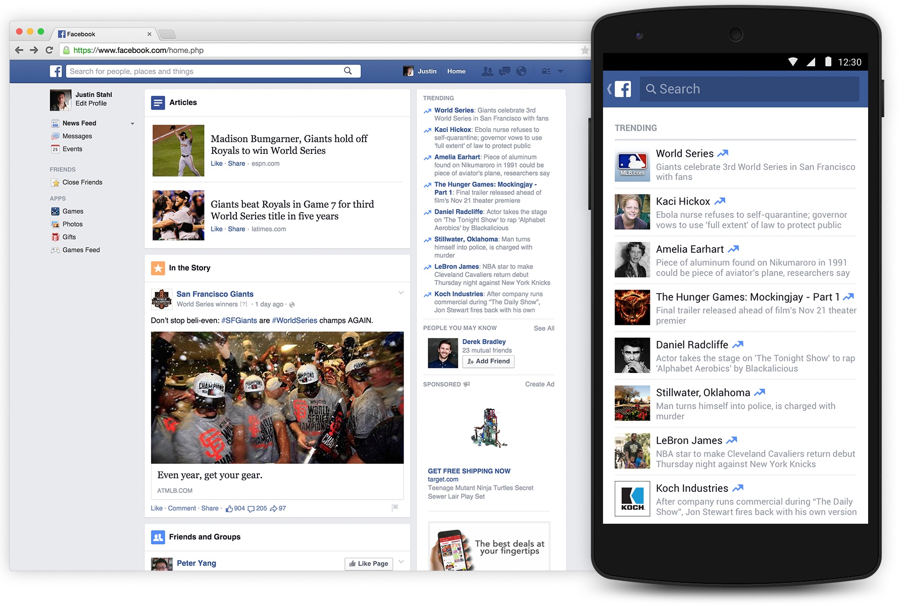
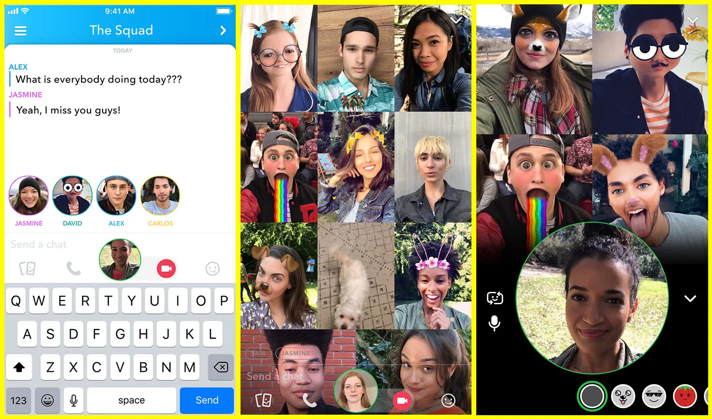
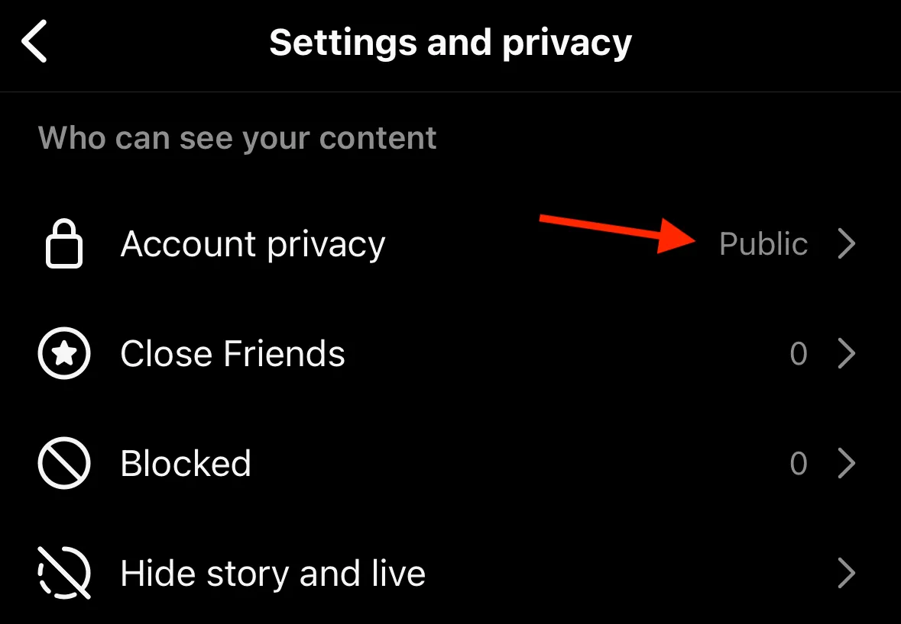
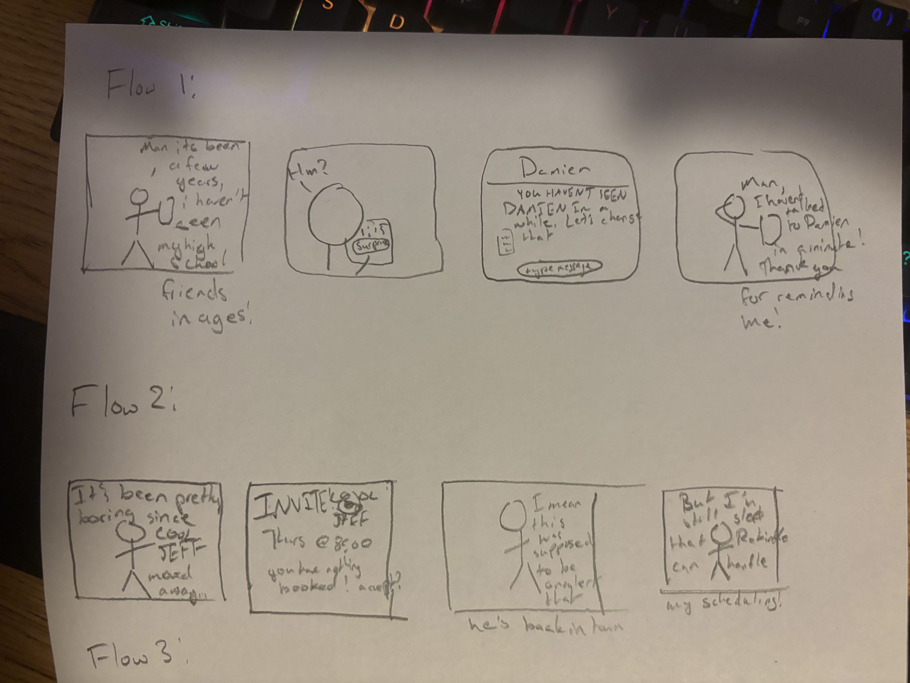

# Rekindle: Bringing the Social Media of the Past to the Future

Application goals!

Intended audience: Older generation + younger generation that feel disconnected from their peers, or looking for more genuine connection on social media

This app aims to take Facebook’s approach of a “social network” and laser-focus it as a way to both connect and reconnect with people in your life who you may not be able to meet in real life.

Scrapbook:

basic layout inspo from facebook!!

snapchat video call!!!

want to focus on user privacy

Feature ideas:

Surprise reconnection: using friend-of-friend metrics (or just seeing who on your friends list you haven’t reached out to lately) and starting a DM conversation with them, the idea is to better keep up with people in your life

Privacy levels: Allow people to only interact with people they are already friends with. May seem counterproductive, but for people who are looking to maintain relationships, preventing unrelated posts from showing up can be nice.

General Privacy Model: There are no public posts on this service, or at least individuals have to go through a more difficult process to get the right to scream their ideas into the void. Bucking the trend of classical social media where followers and likes are points to earn, Rekindle looks to be a more intimate experience.

Crossover: If two people are friends, their friends are not necessarily friends. Two friends can create a Crossover event where temporarily, you can interact with their friends’s friends, allowing for the increase of the intersection of their Friend Diagram.

Calendar integration: Allow for scheduling meetups with people irl, like getting a coffee. Now it’s a specific time, instead of some time!

Shopping Center: Based on Facebook Marketplace, people can advertise stuff that they want to sell/give away here. Can also announce yard/garage sales

Back in Town Alert: With consent, someone can automatically ping everyone that they’re back in town and can hang out.

RSVPs: Allow for the batch sendout (through dms for privacy) of invitations to an event. I’m imagining the same effect as bcc-ing a bunch of people, but integrated into social media!

Random Stuff Sharing: As opposed to announcing big events like cool places you’re going or marriages or whatever (still a thing you could do if you wanted), theres a channel to just post about silly little things, like a cool stick you found, or a dumb video game clip. We’re trying to revitalize the mundane here

Communities: You can join communities, and then post things for those specific communities. I’m envisioning something like how Discord does roles, and you can set your roles to be public or private.

Group Calls: Again, ripping this pretty much straight from Snapchat, but in lieu of being able to see people in person/go to an inperson event, you can have a video call that works like a FaceTime or presentation depending on context.

Sleep schedule: you can set hours during which you will receive notifications through the app. In addition, anyone trying to send you DMs during your sleeping hours gets warned about interrupting you? (could be a privacy concern?)

Delayed message sending: if you toggle a do-not-disturb state in the app, the app will simulate resending that dm once you log back in, or maybe do a catch-up review thing, unsure

Download content: Allow users to (configurable by post) download media in someone else’s post. Creator options include automatically watermarking content downloaded this way to try and mitigate theft.

Log off alert: On login, user can enter a “just 5 minutes” state, after which the app will lock them out for an amount of time that they configure beforehand. This puts you in do-not-disturb mode.

VSD Analysis:

Stakeholders: one indirect stakeholder of this product is actually people who don’t adopt it. There’s a possibility of an in-group forming, wherein people on Rekindle are much more in touch with each other than people who are not, which consequently means the out-group becomes more isolated from those that they know. This could potentially lead to emotional distress.
Soln.: more UI reminders to connect with people in-person, put the phone down, etc.??

The “Back In Town” feature, if used inappropriately, is a potential massive privacy concern, even more so than something like Snap Maps, since the proposed method actively notifies people if someone is in your area. This setting should pretty clearly be a toggle, and opt-in, though users should be notified of its existence.

Time consequences: People grow apart naturally. Bringing people back together can work well, but people can also fall apart and not fit back together again. There is also a concern as to whether the network, with enough random interactions, eventually converges to normal social media again. Maybe we could have all accounts only allow friending through manual acceptance?

Pervasiveness: If your friend list grows large, either you are constantly keeping up with people, or you end up not contacting people very often again. Again, I’m not sure if there is actually a workaround to this specific issue; it may just be inherent to trying to keep in touch with too many people.

Values: this app aims to keep people more intimately connected with those around them. The proposed features all work toward this goal. There is a distinct lack of public-ness, we aim to have this app have very few influencers, if any. There is an inherent tension in how to build community without ostracization, however. Any accomplishment of someone else can create negative feelings in someone who has not accomplished as much. Unfortunately, we believe this to be inherent to the human condition, and occurs irrespective of technology use.

# Example Flows

These look horrible, by the way.

