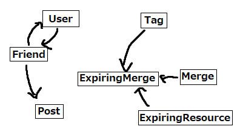

Pitch:

In interview 1, we spoke with an up-and-coming social media influencer. He found social media to be a good form of creative release, and using it as a form of creative release was increasing his overall use of social media. With avenues like YouTube, Instagram, and especially TikTok available, we do not see pursuing this type of user as a valuable endeavor. On the contrary, our second interviewee was a middle-aged woman who, to some extent, didn’t “get” the wider appeal of social media. Preferring to speak primarily with close friends in real life, she mainly engaged with Facebook, which she still didn’t particularly enjoy. She cited the amount of “irrelevant” content, e.g. posts from people she did not know in real life. As such, we propose Rekindle, a social media app for maintaining and reigniting bonds. The site is based on a stripped-down version of the Facebook model, centered around only seeing posts from people you are already connected with. While this may result in less use time per session, we hope that users are less likely to stop using the app, especially if their friends begin using it with them.

# Concepts

## concept Tag[Concept]

purpose separate Concept entities into distinct categories\
principle\
If this Tag[Concept] matches another Tag[Concept2], allow certain actions from Concept, Concept2 to be performed\
state\
None\
actions\
match(this: Tag, other: Tag): bool -> (whether the Tags match by some undetermined standard)\

## concept User

purpose create content\
principle User can create new ContentType objects and have a set of Friends. These Friends may be tagged.\
state\
friends: set Friend\
tags: Friend -> set[Tag] || none\
actions\
// adds Friend to friends\
addFriend(friend: Friend) -> friends += friend\

    // removes Friend from friends. Oh no! :(
    removeFriend(friend: Friend) -> friends -= friend if friend in friends

//adds named tag to friend. these are assigned per user.
addTagToFriend(friend: Friend, tag: Tag[Friend]) -> tags[friend] += tag

//removes named tag from friend. Maybe a typo?
removeTagFromFriend(friend: Friend, tag: Tag[Friend]) -> tags[friend] -= tag if tag in tags[friend]

## concept Friend

purpose control whose content you see\
principle Users can have other users as friends, which allows them to see each others' content. The Friend on its own has essentially no functionality.\
state\
None\
actions\
None\

## concept Merge[Condition1, Condition2]

purpose allow content matching condition1 to interact with objects matching condition2\
principle if conditions are both true, allow cross-interaction between objects\
state\
function condition1\
function condition2\
User sourceUser\
actions\
checkMatch (object1, object2) -> condition1(object1) === condition2(object2)\

## concept ExpiringResource [Resource]

// yes this is copied from the example. I have stuff that expires, too. No need to reinvent the wheel\
purpose handle expiration of short-lived resources\
principle\
after allocating a resource r for t seconds,\
after t seconds the resource expires:\
allocate (r, t); expire (r)\
state\
active: set Resource\
expiry: Resource -> one Date \
actions\
allocate (r: Resource, t: int)\
r not in active\
active += r\
r.expiry := // t secs after now\
deallocate (r: Resource)\
r in active\
active -= r\
r.expiry := none\
renew (r: Resource, t: int)\
r in active\
r.expiry := // t secs after now\
system expire (out r: Resource)\
r in active\
r.expiry is before now\
active -= r\
r.expiry := none\

## concept Timeline[Target]

purpose display specific content\

principle will yield Target’s Timeline, a set of objects relevant to them\

state\

content: set ContentType\
action
// add new ContentType to content
addContent(object) -> content += object

      // remove existing ContentType object from list
      removeContent(object) -> content -= object if object in content

## concept Post[Array[ContentType]]

purpose be content\
Principle\
contains one or multiple objects of arbitrary content type, e.g. text, image, video, gif\
state\
body: set[ContentType]\
author: User || none\
Actions\
// adds new object to body\
add(object: ContentType)\
body += object\

    //removes object from body
    remove(object: ContentType) -> body -= object if object in body

     //sets author of this post object
     setAuthor(author: User, none) -> author = user

## sync ExpiringMerge

include Merge[Tag tag1, Tag tag2]\
include ExpiringResource\
purpose temporarily allow tag1, tag2 content to interact with source sourceUser\
Merge merge = new Merge(lambda tag: Tag.match(tag1), lambda tag: Tag.match(tag2), sourceUser)\
allocate(merge, t)\

# Dependency Diagram

# Wireframes

See my wireframe at https://www.figma.com/design/ed9Qrl1ngfhDCD0LRNsRtn/ReKindle?node-id=0-1&t=oUpvi2BgWRKHcl9S-1! Functionality may be updated over time as I figure out how Figma works.

# Design Tradeoffs

1. Mutual vs Unrequited Friendship
   An interesting side effect of posts being sent to friends instead of a larger audience is that, to some extent, friendship is required to be bidirectional. If we allow people to be friends with people who aren't friends with them, nefarious accounts could force their media onto any other users' feed. Luckily, this reinforces our design goal of friendship in the app being reflective of irl friendships.

2. Compulsory Merge Participation
   Merges also create a potential vulnerability, since it allows other users to have more say over what content you see. The options were between having merges be opt-in versus compulsory. I opted for compulsory merges, since I wanted there to still be a surprise factor of meeting someone you may not have met otherwise. Worst-case, you can always still block people (since I believe there are laws that require that functionality). I may go back on this based on feedback.

3. Merge Creation Placement
   There was a small design tradeoff in how exactly merges were to be created. I had the choice to put it on the Friends screen, but since that screen already held most of the site functionality, I opted to place it on the homescreen, especially since, at time of writing, the homescreen is like 40% empty space.
