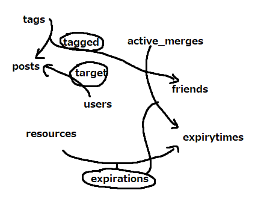

# sorry in advance

# abstract data models

## user, sessioning, friending, posting

given by template

## tagging

set tags: Tag\
relation tagged: Tag -> [Friend || Post]

## merging

set active_merges: Merge[Tag, Tag, User]

## timeline

//since tags are hidden per-client, who gets what post needs to be controlled externally\
//tbh i dont fully understand if concepts are supposed to be overarching or per-session\
//seems like the latter\
set posts: Post\
set users: User\
relation target: User -> Post \

## expiringresource

set resources: Any //anything can expire i guess. temporary posts maybe?\
set expiryTimes: int //time in seconds to expiry
relation expirations: resources -> expiryTimes

# dependency diagram

